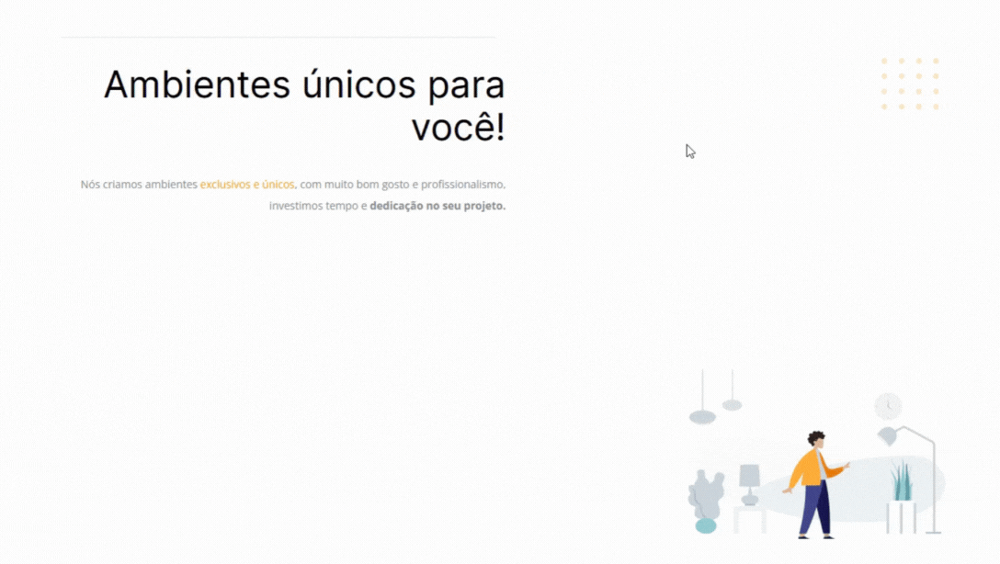

# **Challenge 01**
In this challenge, i was given "broken" HTML and CSS code and the assignment was to fix it in order to recreate the layout provided.

This assignment was made to practice introductory HTML and CSS concepts such as:
- HTML and CSS syntax;
- Setting up the HTML "head" documentation;
- Setting up the HTML "body":
	- Creating divs (with id);
	- Adding headers, paragraphs, images and links;
- CSS cascade effect and specificity;
- Basic CSS properties.

### [Original code](./docs/original-code/)

### Before

### After

### [Return to main](../)