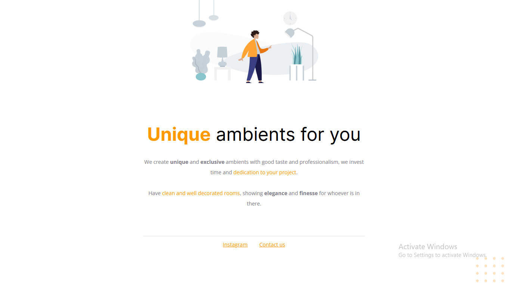

# **Level 02 project 01**

This project was used to follow the classes.
 
Through this one i learned introductory HTML and CSS concepts such as:
- HTML and CSS syntax;
- Setting up the HTML "head" documentation;
- Setting up the HTML "body":
	- Creating divs (with id);
	- Adding headers, paragraphs, images and links;
- CSS cascade effect and specificity;
- Basic CSS properties.
 

### Preview

### [Return to main](../)