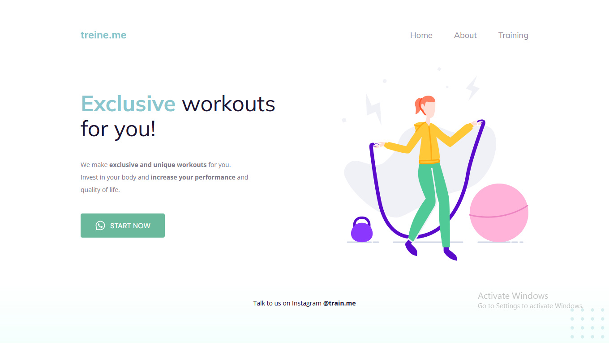

# **Level 02 project 02**

This project was used to follow the classes.
 
Through this one i learned other HTML and CSS concepts and also practiced previously taught concepts such as:
- HTML and CSS syntax;
- Setting up the HTML "head" documentation;
- Setting up the HTML "body":
	- Creating divs (with id);
	- Adding headers, paragraphs, images and links;
- CSS cascade effect and specificity;
- Basic CSS properties.
- Making understandable and acessible HTML:
	- Dividing the code into different parts (nav, main and footer);
	- Creating sections (with classes);
- CSS box model and Flexbox;
- CSS pseudo-classes;
- A few more CSS properties.
 

### Preview

### [Return to main](../)