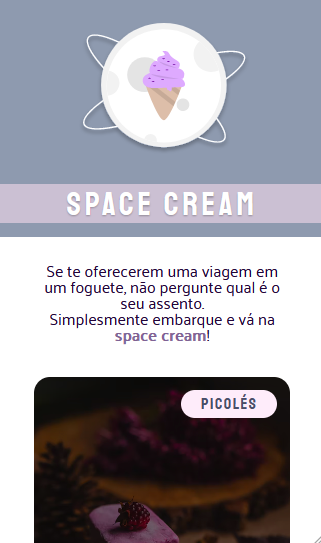

<h1 align = center> Challenge 02</h1>

 This is the second challenge of the third level. 

	<a href="#technologies">Technologies</a>&nbsp;&nbsp;&nbsp;|&nbsp;&nbsp;&nbsp;
  <a href="#project">Project</a>&nbsp;&nbsp;&nbsp;|&nbsp;&nbsp;&nbsp;
  <a href="#layout">Layout</a>&nbsp;&nbsp;&nbsp;

  

## Technologies

This project used these technologies:

- HTML
- CSS

 

## Project

Space cream is a fictional ice cream shop with a space theme. This layout is like the first page of a menu.  
The point of this challenge was to practice these concepts:

- Mobile design;
- Flexible measuring units (rem);
- Variables;
- Simple animations and transitions.

 

## Layout

 

## Thanks for reading!  Diego