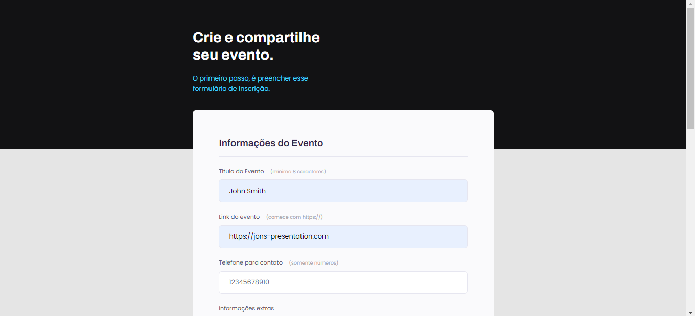
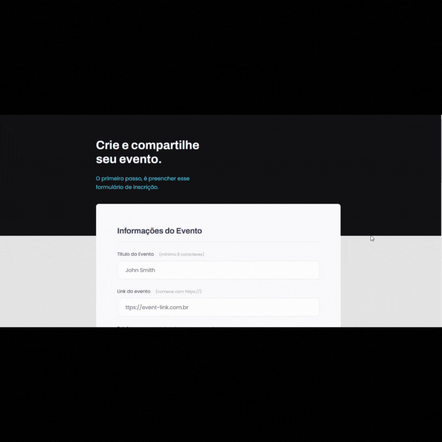

<h1 align = center> Project 03</h1>

 This is the first project from the first module of the third level. 

	<a href="#technologies">Technologies</a>&nbsp;&nbsp;&nbsp;|&nbsp;&nbsp;&nbsp;
  <a href="#project">Project</a>&nbsp;&nbsp;&nbsp;|&nbsp;&nbsp;&nbsp;
  <a href="#layout">Layout</a>&nbsp;&nbsp;&nbsp;

  

 

## Technologies

This project used these technologies:

- HTML;
- CSS.

 

## Project

This is the layout of a form from a fictional event organizer. Here the user would fill the form with their information so the organizer can start planning the event.  
The point of this project was to understand these concepts:

- How HTML forms work;
- HTML fields and fieldsets;
- Inputs and its' different types;
- Data validation and submission (back-end not included);
- More stylization solutions using CSS, e.g.:
	- Customizing different elements inside the same box;
	- Using pseudo-classes to add flavor to the page.

 

## Layout

 

## Thanks for reading!  Diego