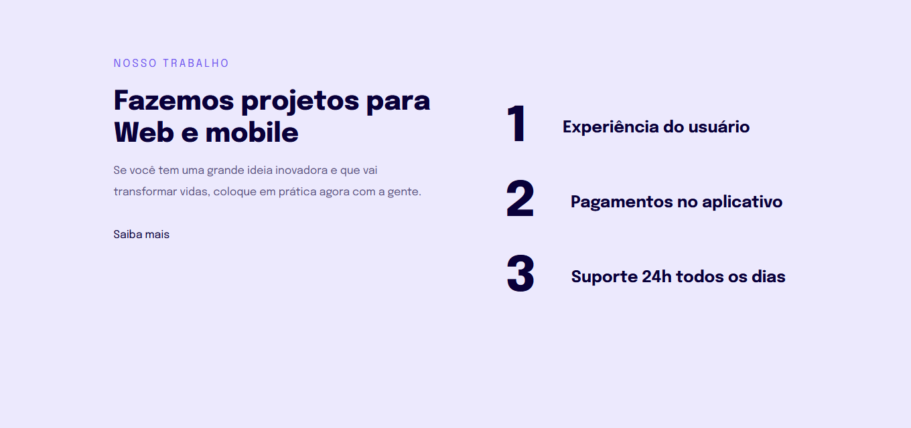

<h1 align = center> Project 04</h1>

 This is the project from the second module of the third level. 

	<a href="#technologies">Technologies</a>&nbsp;&nbsp;&nbsp;|&nbsp;&nbsp;&nbsp;
  <a href="#project">Project</a>&nbsp;&nbsp;&nbsp;|&nbsp;&nbsp;&nbsp;
  <a href="#layout">Layout</a>&nbsp;&nbsp;&nbsp;

  

 

## Technologies

This project used these technologies:

- HTML;
- CSS.

 

## Project

This is the layout of a webpage from a fictional software development company.  
The point of this project was to understand these concepts:

- Responsive design;
- "Mobile first";
- Flexible measuring units (rem);
- Media query.

 

## Layout

### Desktop (minimum width: 700px):

 

### Mobile: 

 

## Thanks for reading!  Diego