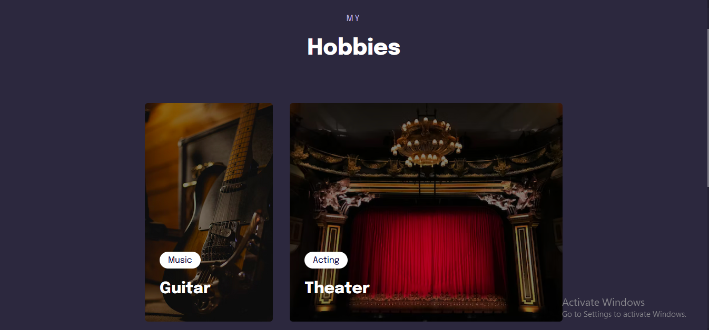

<h1 align = center> Project 05</h1>

 This is the project from the third module of the third level. 

	<a href="#technologies">Technologies</a>&nbsp;&nbsp;&nbsp;|&nbsp;&nbsp;&nbsp;
  <a href="#project">Project</a>&nbsp;&nbsp;&nbsp;|&nbsp;&nbsp;&nbsp;
  <a href="#layout">Layout</a>&nbsp;&nbsp;&nbsp;

  

## Technologies

This project used these technologies:

- HTML;
- CSS.

 

## Project

This is a webpage that display different items in a grid. In this example, it's hobbies.  
The point of this challenge was to practice these concepts:

- Responsive design;
- "Mobile first"
- Flexible measuring units (rem);
- Clamp function;
- Grid display;
- Variables;
- Simple animations and transitions.

 

## Layout
### Desktop (minimum width: 930px):

 
 

### Mobile (minimum width: 700px)

 

## Thanks for reading!  Diego