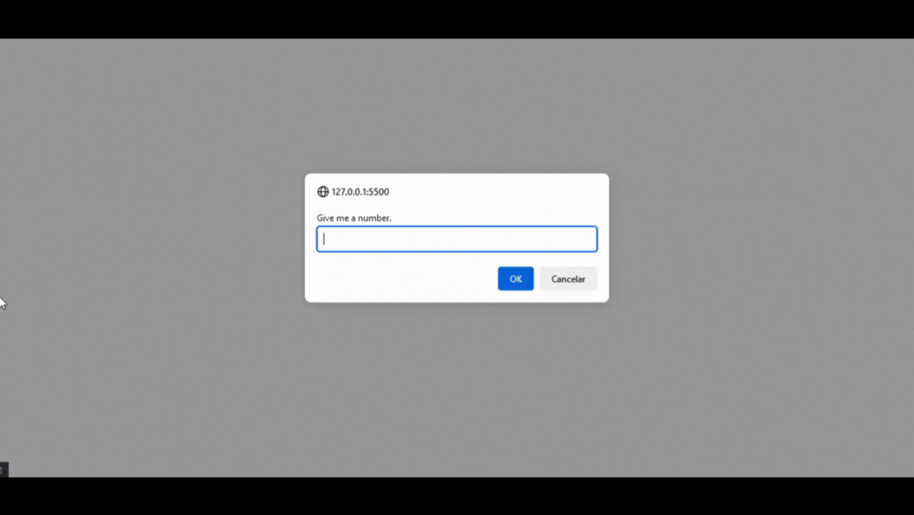

<h1 align = center>Challenge 01</h1>

First challenge of level 04.

	<a href="#technologies">Technologies</a>&nbsp;&nbsp;&nbsp;|&nbsp;&nbsp;&nbsp;
  <a href="#project">Project</a>&nbsp;&nbsp;&nbsp;

  

 

## Technologies

This project used these technologies:

- HTML;
- JavaScript;
- Git.

 

## Project

This challenge is based on the third problem of the [exercise folder](../exercises/exercise/). 
Here, besides doing everything that problem asked, i needed to check if the sum of both numbers is odd or even, and check if the numbers given by the user are different.
 

---
 

### Thanks for reading!  Diego