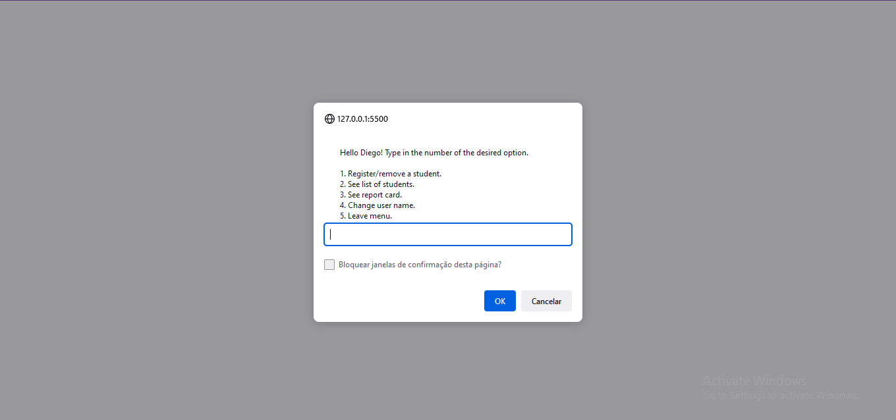
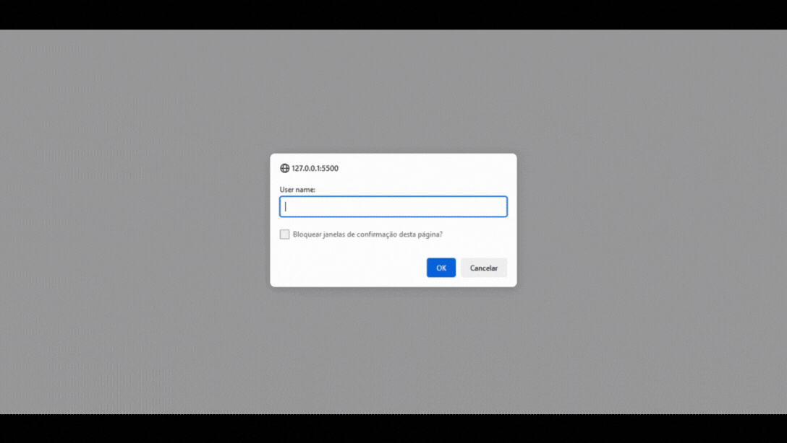
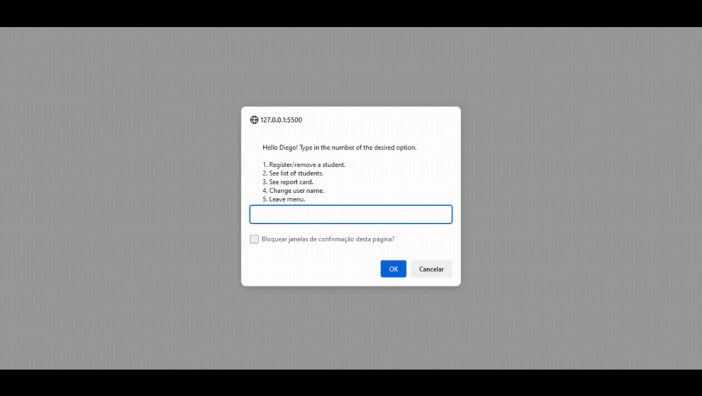

<h1 align = center>Personal project</h1>

This was a project i decided to do to practice all i learned in this level.

	<a href="#technologies">Technologies</a>&nbsp;&nbsp;&nbsp;|&nbsp;&nbsp;&nbsp;
	<a href="#project">Project</a>&nbsp;&nbsp;&nbsp;|&nbsp;&nbsp;&nbsp;
  <a href="#demonstration">Demonstration</a>&nbsp;&nbsp;&nbsp;

  

 

## Technologies

This project used these technologies:

- HTML;
- JavaScript;
- Git.

 

## Project

This project is not a part of the Explorer course. 
It's a combination of the [second challenge](../challenge-02/) and the [interactive menu](../exercises/option-menu/). 
Here, i created an interactive menu of a school system. 
The user can register or remove a student from the system, see a list of registered students and their report cards, they can even change their user name. 
P.S.: Grades go from 0 to 10 and the passing score is 7. Lower than 3 results in an automatic fail.
 

## Demonstration

---
 

### Thanks for reading!  Diego