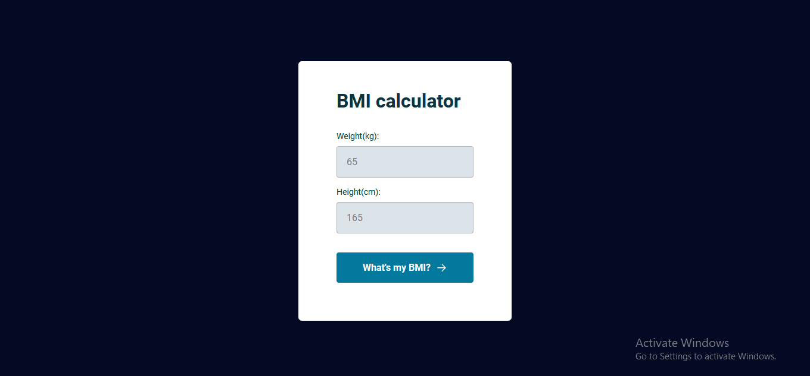
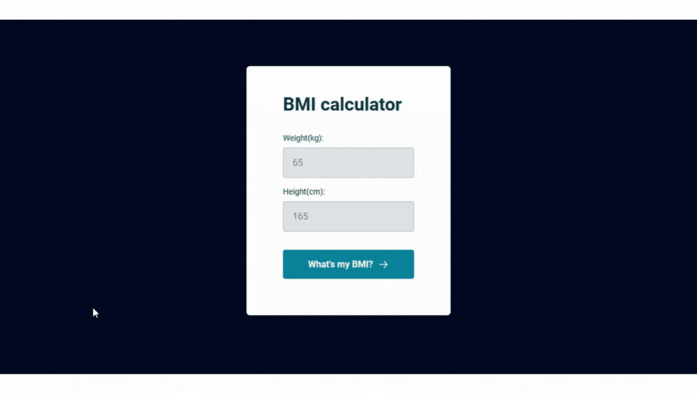

<h1 align = center>BMI calculator</h1>

This was the project used to follow the classes from the second module of level 05.

	<a href="#technologies">Technologies</a>&nbsp;&nbsp;&nbsp;|&nbsp;&nbsp;&nbsp;
	<a href="#project">Project</a>&nbsp;&nbsp;&nbsp;|&nbsp;&nbsp;&nbsp;
  <a href="#demonstration">Demonstration</a>&nbsp;&nbsp;&nbsp;

  

 

## Technologies
This project used these technologies:

- HTML;
- CSS;
- JavaScript;
- DOM;
- Git.

 

## Project
This is a BMI calculator. The user puts their weight (kg) and height (cm) in and a window pops up with their BMI. 
Based on the [BMI exercise](../../level-04/exercises/patient-bmi/) from level 04.

 

## Demonstration

---
 

### Thanks for reading!  Diego