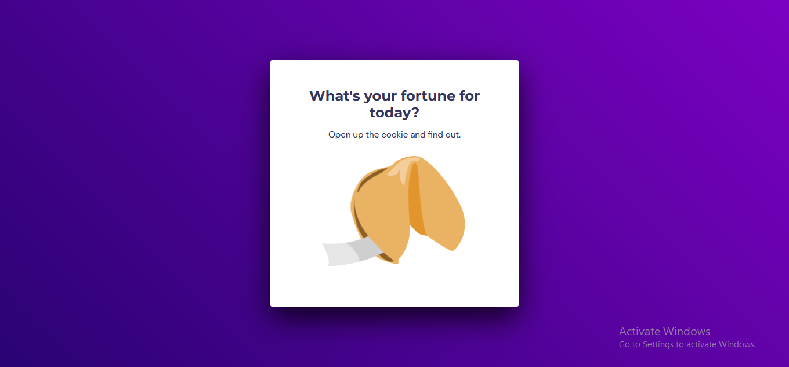

<h1 align = center>Fortune cookie</h1>

This was the project used to practice what i learned at the first module of level 05.

	<a href="#technologies">Technologies</a>&nbsp;&nbsp;&nbsp;|&nbsp;&nbsp;&nbsp;
	<a href="#project">Project</a>&nbsp;&nbsp;&nbsp;|&nbsp;&nbsp;&nbsp;
  <a href="#demonstration">Demonstration</a>&nbsp;&nbsp;&nbsp;

  

 

## Technologies
This project used these technologies:

- HTML;
- CSS;
- JavaScript;
- DOM;
- Git.

 

## Project
This is a "fortune cookie". The user clicks the cookie to open it and they get a random fortune from the selection inside the code.

 

## Demonstration

---
 

### Thanks for reading!  Diego