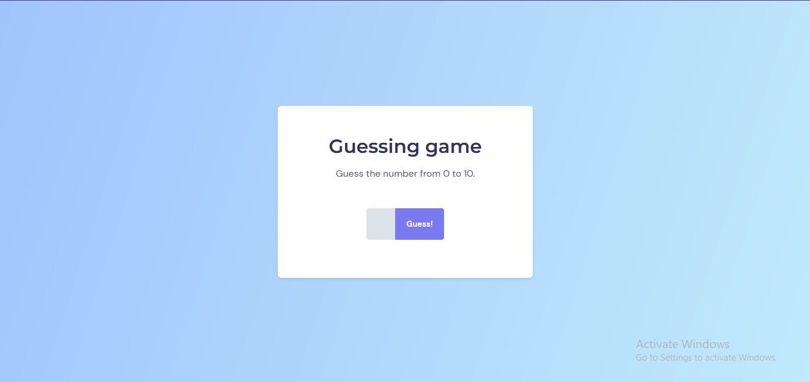
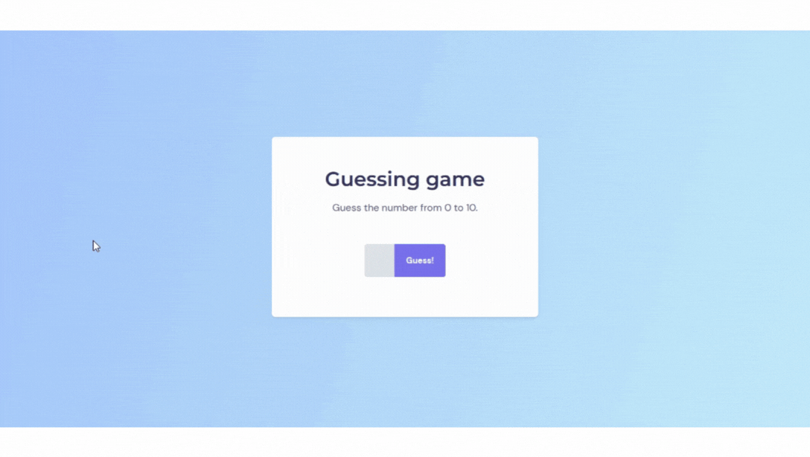

<h1 align = center>Guessing game</h1>

This was the project used to follow the classes of the first module of level 05.

	<a href="#technologies">Technologies</a>&nbsp;&nbsp;&nbsp;|&nbsp;&nbsp;&nbsp;
	<a href="#project">Project</a>&nbsp;&nbsp;&nbsp;|&nbsp;&nbsp;&nbsp;
  <a href="#demonstration">Demonstration</a>&nbsp;&nbsp;&nbsp;

  

 

## Technologies

This project used these technologies:

- HTML;
- CSS;
- JavaScript;
- DOM;
- Git.

 

## Project

This is a guessing game where the user guesses the number the program is thinking of.
It's between 0 and 10. 
This application is based on the [guessing game exercise](../../level-04/exercises/guessing-game) from level 04.

 

## Demonstration

---
 

### Thanks for reading!  Diego