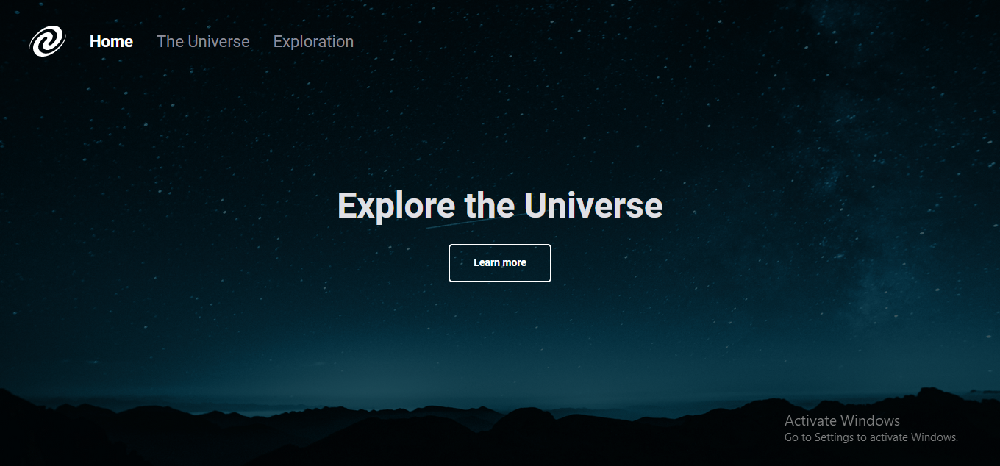

<h1 align = center>SPA Universe</h1>

This was the challenge from the first module of level 06.

	<a href="#technologies">Technologies</a>&nbsp;&nbsp;&nbsp;|&nbsp;&nbsp;&nbsp;
	<a href="#project">Project</a>&nbsp;&nbsp;&nbsp;|&nbsp;&nbsp;&nbsp;
	<a href="#demonstration">Demonstration</a>&nbsp;&nbsp;&nbsp;

  

 

## Technologies
This project used these technologies:

- HTML;
- JavaScript;
- CSS;
- Node;
- Git.

 

## Project
This is a simple page about the universe. 
The goal of this project was to apply what we learned with the [previous project](../spa/) in a page.

 

## Demonstration
https://user-images.githubusercontent.com/87144284/215178696-c6a4ed78-24c2-4d30-9b5f-87bcae34ac92.mp4

---
 

### Thanks for reading!  Diego