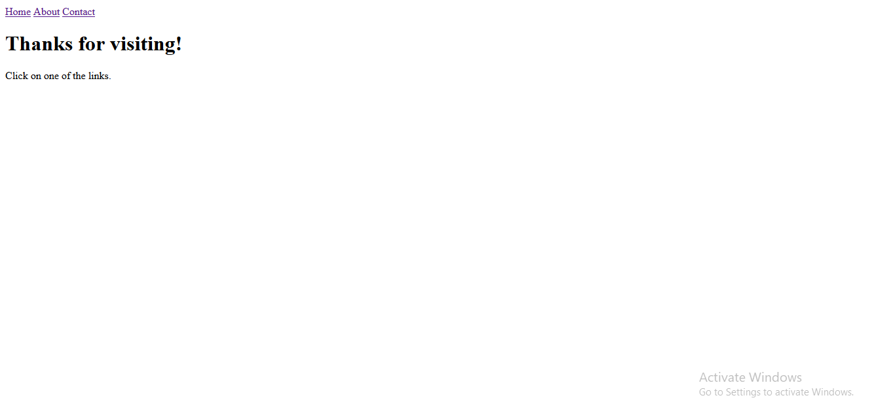

<h1 align = center>SPA</h1>

This was the project used to follow the classes of the first module from level 06.

	<a href="#technologies">Technologies</a>&nbsp;&nbsp;&nbsp;|&nbsp;&nbsp;&nbsp;
	<a href="#project">Project</a>&nbsp;&nbsp;&nbsp;|&nbsp;&nbsp;&nbsp;
	<a href="#demonstration">Demonstration</a>&nbsp;&nbsp;&nbsp;

  

 

## Technologies
This project used these technologies:

- HTML;
- JavaScript;
- Node;
- Git.

 

## Project
This is a simple page with some links. 
The goal of this project was to study about routes, single page application, async JS and promises, object oriented programming, node.js and JSON.

 

## Demonstration
https://user-images.githubusercontent.com/87144284/214734031-99335f42-2990-4d61-8ca7-251da14c57e6.mp4

---
 

### Thanks for reading!  Diego